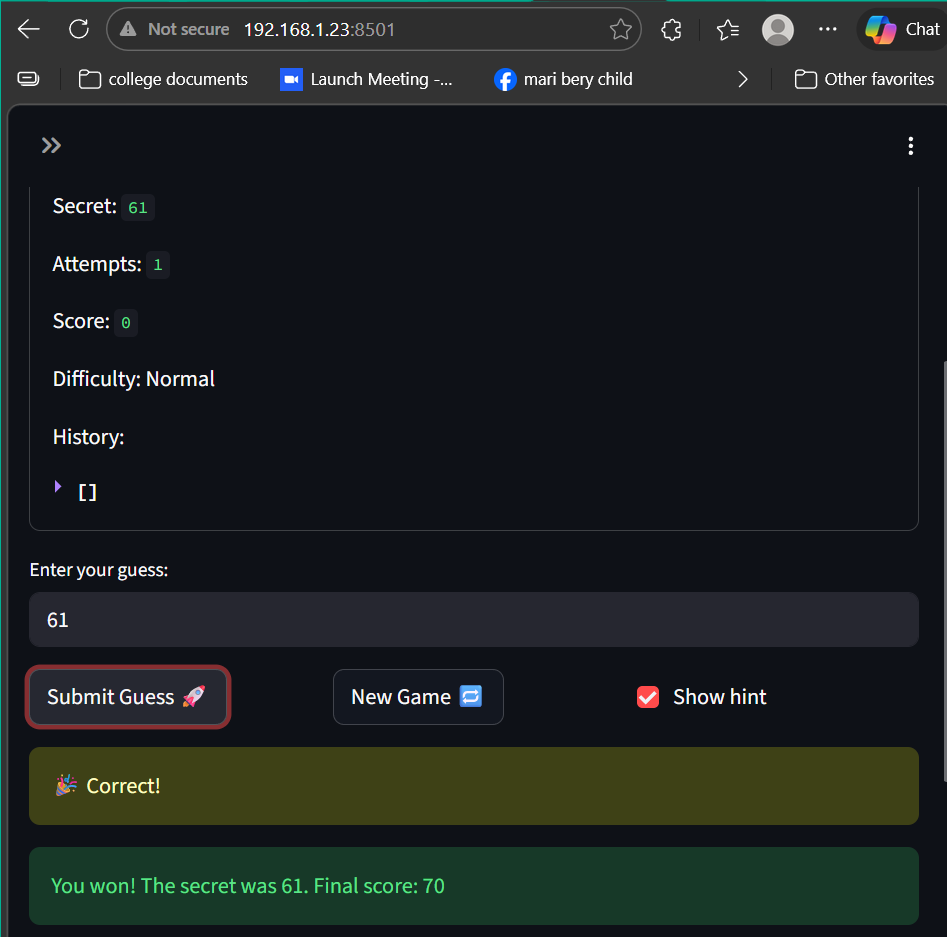
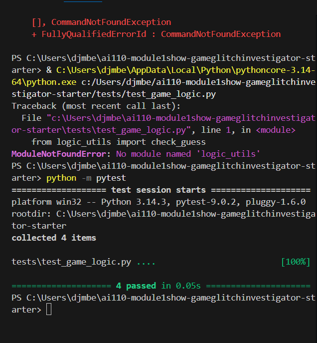

# 🎮 Game Glitch Investigator: The Impossible Guesser

## 🚨 The Situation

You asked an AI to build a simple "Number Guessing Game" using Streamlit.
It wrote the code, ran away, and now the game is unplayable. 

- You can't win.
- The hints lie to you.
- The secret number seems to have commitment issues.

## 🛠️ Setup

1. Install dependencies: `pip install -r requirements.txt`
2. Run the broken app: `python -m streamlit run app.py`

## 🕵️‍♂️ Your Mission

1. **Play the game.** Open the "Developer Debug Info" tab in the app to see the secret number. Try to win.
2. **Find the State Bug.** Why does the secret number change every time you click "Submit"? Ask ChatGPT: *"How do I keep a variable from resetting in Streamlit when I click a button?"*
3. **Fix the Logic.** The hints ("Higher/Lower") are wrong. Fix them.
4. **Refactor & Test.** - Move the logic into `logic_utils.py`.
   - Run `pytest` in your terminal.
   - Keep fixing until all tests pass!

## 📝 Document Your Experience

- **Game Purpose:** This is a number guessing game where the player tries to guess a secret number between 1 and 100. The player gets a limited number of attempts depending on difficulty, and receives hints after each guess to guide them toward the answer.

- **Bugs Found:**
  - The hints were completely backwards — guessing too low said "Go LOWER" and guessing too high said "Go HIGHER," leading players away from the answer.
  - The score went negative immediately, dropping by 5 points every guess due to broken scoring logic.
  - The attempts counter on screen did not match the debug panel, showing two different numbers at the same time.
  - The game accepted invalid inputs like -100 with no error or rejection message.
- **Fixes Applied:**
  - Moved `check_guess` into `logic_utils.py` and corrected the swapped hint messages so "Too High" returns "Go LOWER" and "Too Low" returns "Go HIGHER."
  - Removed the string conversion bug where the secret number was being turned into a string on even-numbered attempts, which was causing incorrect comparisons.
  - Updated `test_game_logic.py` to correctly unpack the tuple returned by `check_guess` and added a new test targeting the backwards hint bug specifically.
  - All 4 pytest tests now pass successfully.
## 📸 Demo

- [ ] [Insert a screenshot of your fixed, winning game here]

## 🚀 Stretch Features

- [ ] [If you choose to complete Challenge 4, insert a screenshot of your Enhanced Game UI here]
